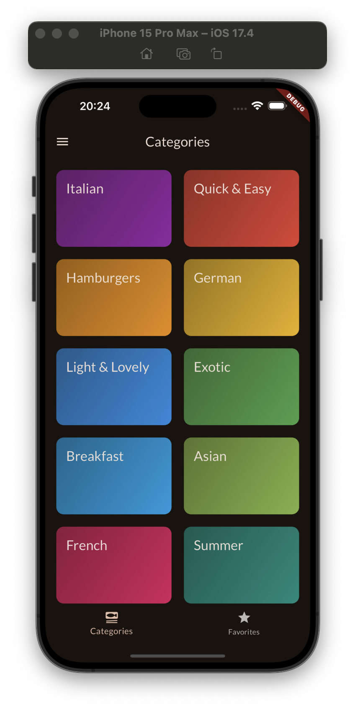
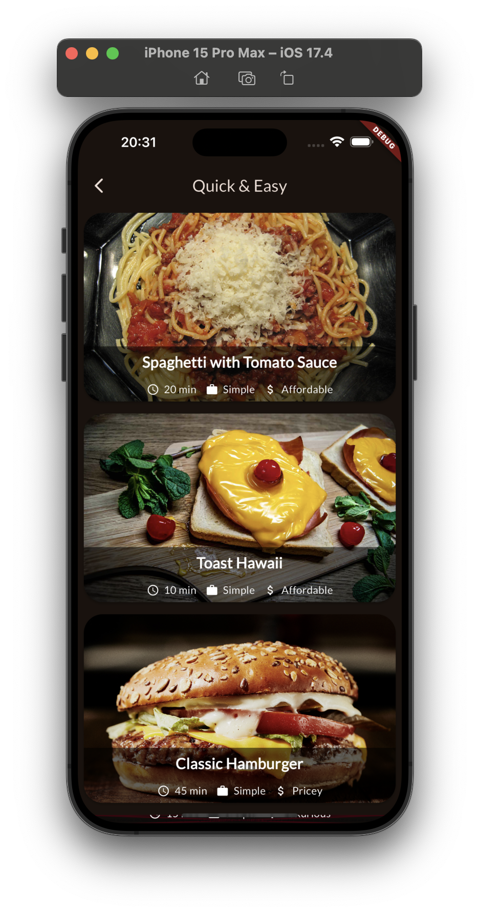
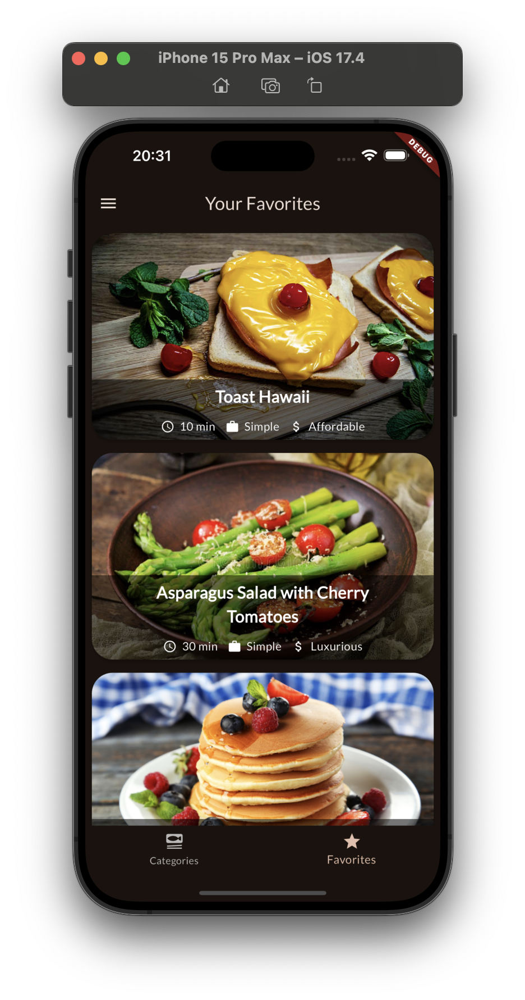
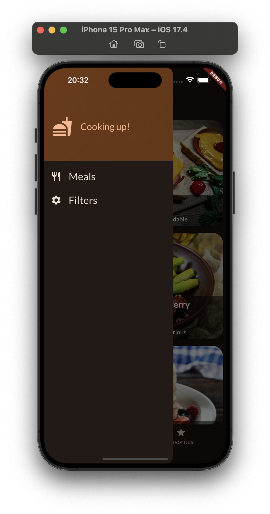
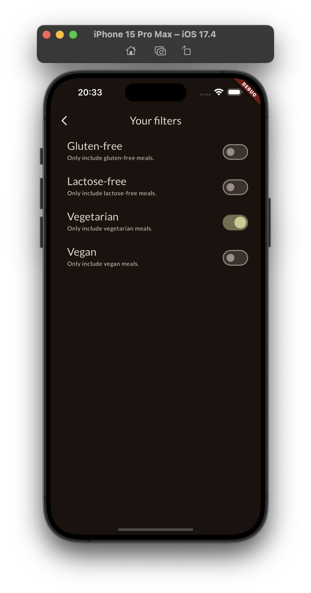
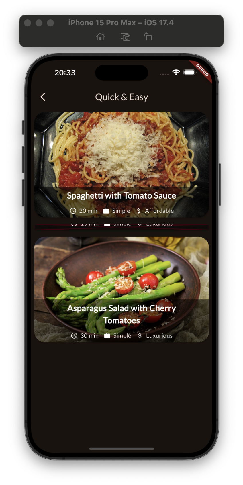

# Meals app
 The application was developed on a course https://www.udemy.com/course/learn-flutter-dart-to-build-ios-android-apps/

In this app, you can select different recipes by category. You can also customize filters and add them to your favorites.

 

The project is based on Riverpod state-management.

